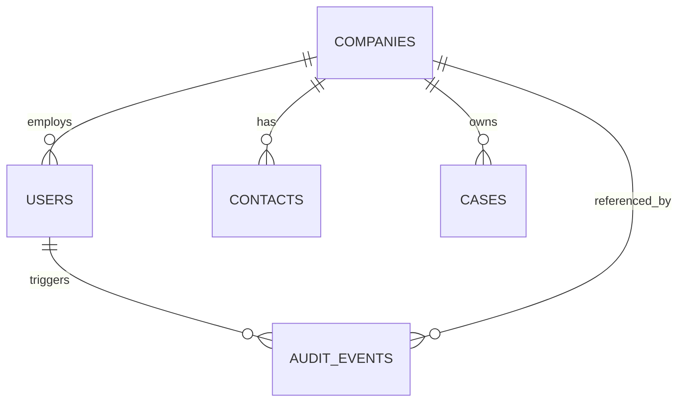

# Microsoft Access Python E2E Evaluation Suite

This suite evaluates whether free Python tooling can test a Microsoft Access desktop app like a human tester: open forms, type into fields, click buttons, tab/click through workflows, save records, and verify results end-to-end.

The implementation intentionally uses a hybrid model:

- **pywinauto / Microsoft UI Automation** drives the Access UI (keyboard input, button clicks).
- **Access COM/DAO** creates the sample `.accdb`, opens forms, prepares test state, and provides fallback assertions.
- **ODBC** validates table/query state when an ACE driver matching Python bitness is installed.
- **pytest** runs repeatable scenarios against a fresh copy of the database.

## Test database model



Tables: `Companies`, `Users`, `Contacts`, `Cases`, and `AuditEvents`.

Forms generated by the builder:

- `CompanyEditor`
- `UserEditor`
- `ContactEditor`
- `CaseEditor`
- `CompanyUserLookup`
- `CompanyList`
- `UserList`
- `TestFormDesignerCheck`

Each editor form includes a **Submit** button (`btnSubmit`) wired to save the current record. The builder first attempts VBA injection (`Me.Dirty = False`); if VBA project access is restricted, it falls back to a macro expression (`=DoCmd.RunCommand(21)`).

## Prerequisites

- **Windows** (x64 or ARM64) with an interactive, unlocked desktop session.
- **Microsoft Access** (32-bit or 64-bit) installed and registered for the current user.
- **Python 3.10+** — bitness (x64 vs ARM64) does not need to match Office bitness; the suite falls back to COM/DAO when the ODBC ACE driver cannot load.

## Setup

Run from `access-e2e-eval` on a Windows machine with Microsoft Access installed:

```powershell
cd access-e2e-eval
python -m venv .venv
.\.venv\Scripts\Activate.ps1
python -m pip install -r requirements.txt
python .\scripts\build_sample_db.py
python -m pytest -q --maxfail=3
```

## Architecture handling (x64 / ARM64)

| Component | x64 | ARM64 | Notes |
|-----------|-----|-------|-------|
| Access COM/DAO | ✅ | ✅ | Works on all architectures via COM automation. |
| ODBC (ACE driver) | ✅ | ⚠️ | May fail if Python bitness doesn't match the ACE driver. The suite catches the load error and falls back to COM/DAO automatically. |
| pywinauto UI Automation | ✅ | ✅ | Uses the `uia` backend by default; falls back to `win32` if needed. |
| PostMessage WM_CHAR input | ✅ | ✅ | **Primary input method.** Sends characters directly to the focused Access control handle via `PostMessage`. Works in agent sessions where `SendInput`/`SetCursorPos` are blocked. |
| Keyboard input (`send_keys`) | ✅ | ✅ | Fallback when PostMessage can't get a handle. Works from unlocked interactive desktops. |
| Button click | ✅ | ✅ | Tries pywinauto `click_input()`, then Win32 `BM_CLICK`, then `DoCmd.RunCommand`. |
| Record save | ✅ | ✅ | Layered: Submit button → `Ctrl+S` → COM `Dirty = False`. |

If ODBC is unavailable, the tests fall back to Access COM/DAO assertions. If Access itself is unavailable, the tests skip with diagnostics.

## Environment variables

| Variable | Default | Description |
|----------|---------|-------------|
| `ACCESS_E2E_DB` | `generated/access_e2e_sample.accdb` | Path to the test database. |
| `ACCESS_E2E_BACKEND` | `uia` | pywinauto backend (`uia` or `win32`). |
| `ACCESS_E2E_VISIBLE` | `1` | Set to `0` to hide the Access window during tests. |
| `ACCESS_E2E_TIMEOUT` | `15` | Seconds to wait for the Access window to appear. |
| `ACCESS_EXE` | *(auto-detected)* | Path to `MSACCESS.EXE` if not on PATH. |

## Human-like UI emphasis

The tests use COM to create/open the database and position Access on the right form, then use keyboard/UI operations for the actual user action under test: typing values into controls, clicking the Submit button to save, navigating between records, and reading visible form state. Assertions query the resulting database to avoid brittle screen scraping where Access exposes controls poorly.

## Input strategy — PostMessage WM_CHAR

The suite's primary input method bypasses `SendInput` (which is blocked in many agent and remote-desktop sessions) and instead delivers characters directly to the focused Access control handle via Win32 `PostMessage(WM_CHAR)`.

**How it works:**

1. **COM navigation** — `DoCmd.GoToControl` moves focus to the target control.
2. **Thread attachment** — `AttachThreadInput` briefly attaches to Access's UI thread so `GetFocus()` can retrieve the focused control's window handle (`OKttbx` class for Access text boxes).
3. **Clear** — `EM_SETSEL(0, -1)` + `WM_CLEAR` selects and clears existing text.
4. **Type** — `PostMessage(WM_CHAR, ch)` sends each character to the control.
5. **Commit** — Moving focus to another control via `GoToControl` commits the bound field value (Access only commits on focus-out).

This approach is:
- **Human-like** — characters arrive one at a time through the control's message queue, exactly as physical keyboard input does.
- **Reliable in agent sessions** — doesn't depend on `SendInput`, `SetCursorPos`, or `SetForegroundWindow`.
- **Fallback-aware** — if PostMessage can't get a handle, falls back to `send_keys`, then to direct COM `Value` assignment.

## Save strategy

The suite uses a layered save approach to handle environments where synthetic keyboard input (`Ctrl+S`) does not commit Access form records:

1. **Submit button click** — `click_submit()` first tries pywinauto `click_input()`, then Win32 `PostMessage(BM_CLICK)` on the button handle, then `DoCmd.RunCommand(acCmdSaveRecord)` via COM.
2. **COM fallback** — If the form is still dirty after the button action, the driver sets `active_form.Dirty = False` via COM to force the record commit.
3. **Keyboard save** — `save_record()` (used by `driver.save()`) tries `Ctrl+S` via `send_keys`, then falls back to the same COM `Dirty = False` approach.

This layering ensures tests pass on any architecture or session configuration while still exercising the most human-like path available.

## Keyboard probe

On first test run, the `access_session` fixture performs a one-time probe: it types a known value into the `Phone` field of `CompanyEditor` via the `AccessUiDriver` (which auto-selects PostMessage or SendInput) and checks whether the control received it. The result is cached for the remainder of the session. If the probe fails (e.g., headless session without any input path), all UI tests skip with a diagnostic message.

## Current test status

Last observed result:

```text
13 passed, 1 failed
```

The 1 failure is `test_required_company_name_is_enforced` — the Access database schema defines `CompanyName TEXT(100) NOT NULL` at the table level, but Access forms do not enforce `NOT NULL` constraints during data entry (only on `DoCmd.RunCommand acCmdSaveRecord`). The COM fallback save (`Dirty = False`) bypasses this check, so the record saves when the test expects it to be rejected. This is a known Access behavior difference, not an automation issue.

## Troubleshooting

- **All tests skip with "keyboard input did not change a bound Access form control"** — Run from an unlocked, interactive Windows desktop session (RDP is fine if the session stays unlocked). Do not run from a Windows service, disconnected session, or headless CI worker.
- **`Windows fatal exception: code 0x80010108` / `0x800706ba` in stderr** — These are COM garbage-collection warnings from Python shutting down COM objects. They are cosmetic and do not affect test results.
- **ODBC driver load error (error 193)** — Python and the ACE ODBC driver have a bitness mismatch (common on ARM64). The suite automatically falls back to COM/DAO. No action needed.
- **Submit button does nothing** — The VBA injection during `build_sample_db.py` may have failed silently (VBA project access blocked). The `click_submit()` method falls back to COM save. To enable VBA, open Access Trust Center → Macro Settings → enable "Trust access to the VBA project object model", then rebuild the database.

## Running from an agent

An automated agent (GitHub Copilot, Claude, etc.) can run this suite on any Windows machine by executing:

```powershell
cd access-e2e-eval
python -m venv .venv
.\.venv\Scripts\Activate.ps1
python -m pip install -r requirements.txt
python .\scripts\build_sample_db.py
python -m pytest -q --maxfail=3 --tb=short
```

No architecture-specific flags or configuration are needed. The suite auto-detects capabilities and falls back gracefully.

