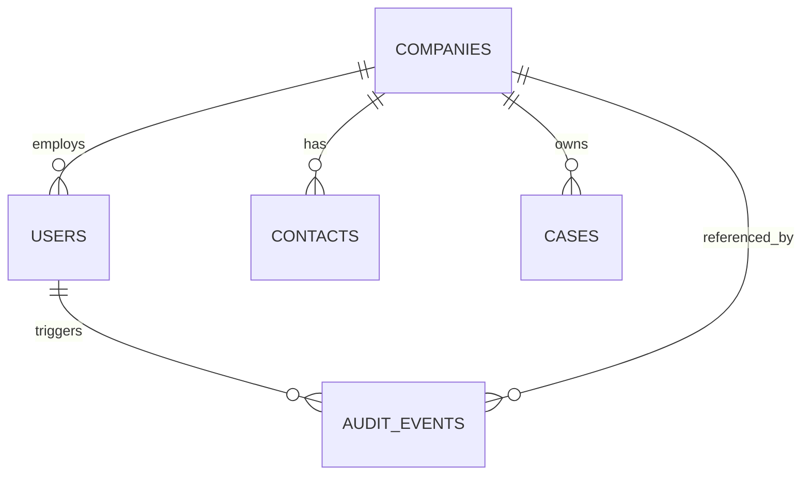

# Microsoft Access Python E2E Evaluation Suite

This suite evaluates whether free Python tooling can test a Microsoft Access desktop app like a human tester: open forms, type into fields, tab/click through workflows, save records, and verify results end-to-end.

The implementation intentionally uses a hybrid model:

- **pywinauto / Microsoft UI Automation** drives the Access UI.
- **Access COM/DAO** creates the sample `.accdb`, opens forms, prepares test state, and provides fallback assertions.
- **ODBC** validates table/query state when an ACE driver matching Python bitness is installed.
- **pytest** runs repeatable scenarios against a fresh copy of the database.

## Test database model



Tables: `Companies`, `Users`, `Contacts`, `Cases`, and `AuditEvents`.

Forms generated by the builder:

- `CompanyEditor`
- `UserEditor`
- `ContactEditor`
- `CaseEditor`
- `CompanyUserLookup`
- `CompanyList`
- `UserList`
- `TestFormDesignerCheck`

## Setup

Run this from `access-e2e-eval` on a Windows machine with Microsoft Access installed:

```powershell
python -m venv .venv
.\.venv\Scripts\Activate.ps1
python -m pip install -r requirements.txt
python .\scripts\build_sample_db.py
python -m pytest
```

If ODBC is unavailable, the tests fall back to Access COM/DAO assertions. If Access itself is unavailable, the tests skip with diagnostics.

## Human-like UI emphasis

The tests use COM to create/open the database and position Access on the right form, then use keyboard/UI operations for the actual user action under test: typing values into controls, saving records, navigating between records, and reading visible form state. Assertions query the resulting database to avoid brittle screen scraping where Access exposes controls poorly.

## Current handoff status

Last observed result in this environment:

```text
1 passed, 13 skipped
```

Access COM works, the sample `.accdb` can be generated, and pywinauto can attach to the Microsoft Access window. The current blocker is full human-like UI input: pywinauto can focus Access, but synthetic keyboard input does not change a bound Access form control in this session.

This means the suite is ready to rerun from an unlocked, interactive Windows desktop session where Office apps can receive synthetic keyboard and mouse input. On an Azure VM, run the tests from a visible RDP or console session, keep the session unlocked, and do not run the tests from a Windows service, disconnected session, or headless CI worker.

Run:

```powershell
cd C:\Users\teranlong\Workspace\access-e2e-eval
.\.venv\Scripts\python.exe -m pytest -q
```

If the keyboard-input probe passes in that session, the UI scenarios should execute instead of skipping. If it still fails, the next investigation should compare pywinauto `uia` vs `win32` backends, then evaluate AutoIt or image-based SikuliX for the UI input layer while keeping the existing Access COM/DAO/ODBC validation approach.

